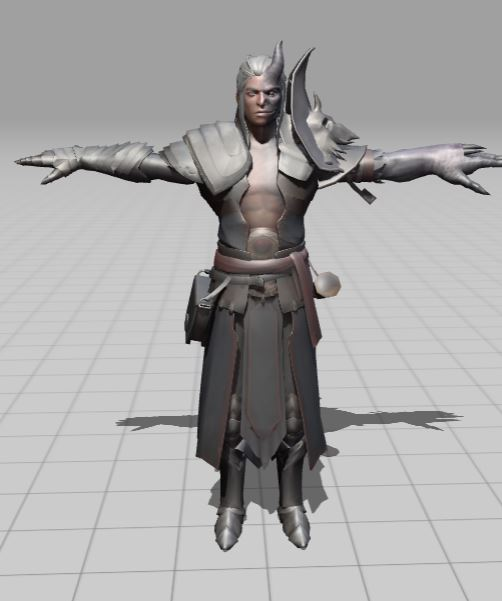
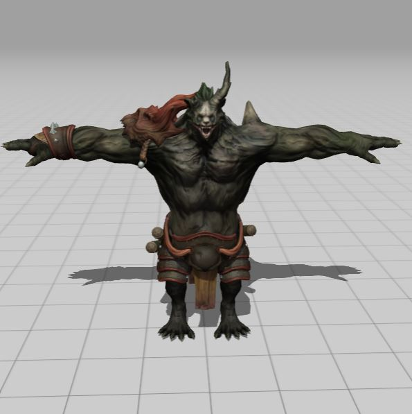
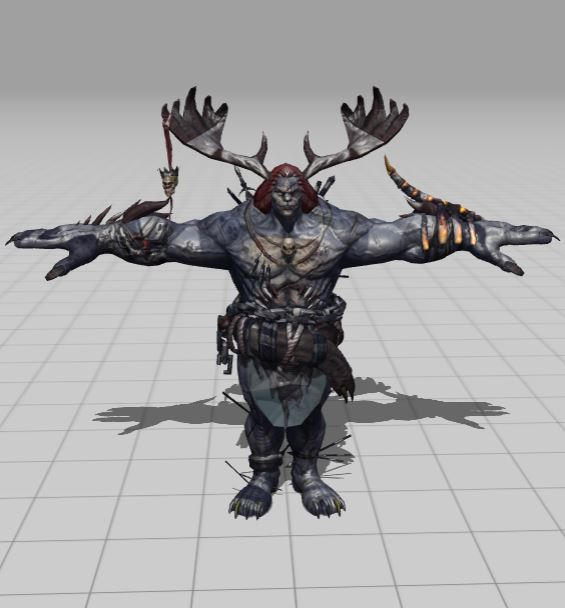
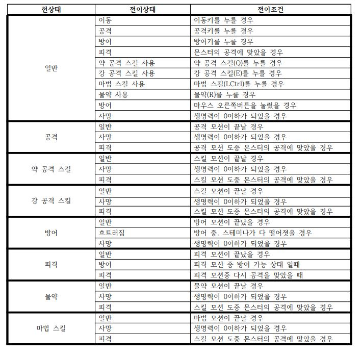
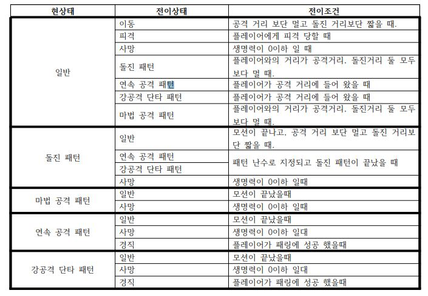
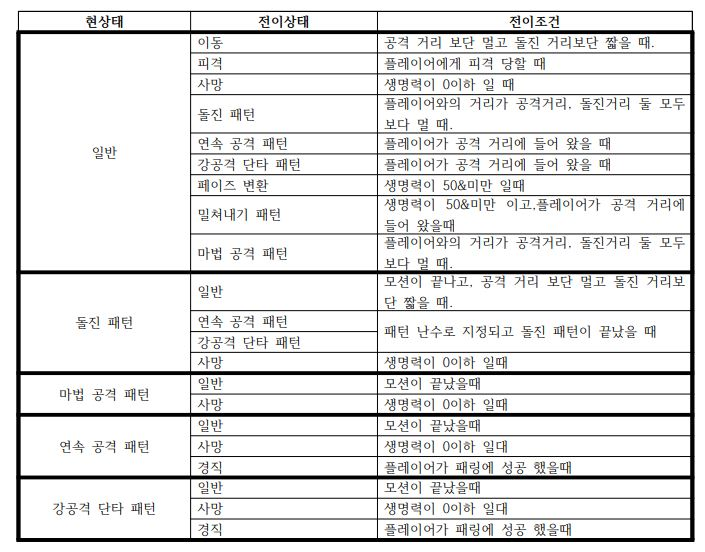
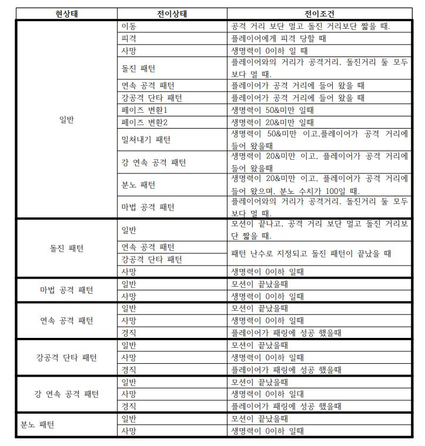

# 프로젝트명: Magnus Bellator(위대한 전사) 1888003 김대겸

## [목차]

### [1.컨셉](#컨셉)

### [2. 관련 이미지 & 동영상](#관련-이미지-and-동영상)

### [3. 대표 이미지](#대표-이미지)

### [4.컨셉 & 대표이미지 기반 작품묘사](#컨셉-and-대표이미지-기반-작품묘사)

### [5.구성 요소](#구성-요소)

+ #### 5-1 메커니즘
   
+ #### 5-2 이야기

+ #### 5-3 미적요소

+ #### 5-4 기술

### [6.시스템 기획](#시스템-기획)

+ #### 6-1 게임오브젝트 분해

+ #### 6-2 오브젝트 속성

+ #### 6-2 캐릭터 속성

+ #### 6-4 행동

+ #### 6-5 상태

### [7.게임 규칙](#게임-규칙)

### [8.게임에서 사용될 공식](#게임에서-사용될-공식)

### [9.요구 사항](#요구-사항)

# [컨셉]

### 메인컨셉 : 타격감

- RPG 게임인 만큼 타격감에 집중하여 플레이어들이 좀더 흥미를 가지고 플레이 할수 있게 하기 위해서 선택 함.

### 서브 컨세 1 : 이펙트

- 타격감에 영향을 주는것중 가장 많은 비중을 차지하는 것은 역시 눈으로 보이는 이펙트라고 생각하여 타격감을 보조해줄 서브 컨샙으로 지정 함.

### 서브 컨세 2 : 효과음

- 타격감에는 시각적 요소 뿐만아니라 청각(효과음)으로 낼수있는 타격감도 있으므로 보조하기위한 서브 컨샙으로 충분하다고 생각됨.

### 서브 컨세 3 : 몬스터

- RPG 게임인 만큼 몬스터의 존재또한 중요하게 생각됨 특히 몬스터를 공격함으로 얻는 타격감을 강조하여 플레이어의 사냥 욕구를 충족 시킬 예정

### 서브 컨세 4 : AI

- 가만히 있는 몬스터를 공격 하는것 보단 보다 유기적으로 행동 하고 상호작용을 할수 있는 AI가 있으면 게임 플레이함에 있어 좋은 자극이 될 것으로 생각 됨

### 서브 컨세 5 : 아이템

- 여러 아이템을 통하여 공격 방식이나 타격감을 변경하여 금방 질리지 않는 게임을 만들 것.

  

# [관련 이미지 and 동영상]

1. 세키로:
    
    
    
    적과 플레이어의 공격이 부딪힐때 나는 특유의 효과음과 시각적으로 보이는 이펙트가 인상적이다.

    적의 공격을 정확한 타이밍에 막았을때와 그러지 않을 때의 효과들이 달라서 플레이어가 직접적으로 확인 가능하다.
    
    타이밍을 맞춰 완벽하게 막았을 때
    
    
            
    막는 것은 성공 하였으나 타이밍이 늦었을 때
    
    

2. 엘든링

    
    
    공격 모션이 같으나 이펙트가 확연히 달라 서로 다른 마법이란 것 뿐만아니라 어느 효과가 있는지 또는 속성을 보여주는지 알 수 있음.

    마법에 큰 틀에 해당하는 컨셉이 있고 거기서 갈라나와 여려 마법이 파생되는 느낌을 보여줌 -> 플레이어의 롤플레잉에 재미를 높여주는 것이 가능

3. 총평: 두 게임에서 효과음과 이펙트를 이용하여 높은 타격감과 시각적 만족감을 보여줌, 또한 부드럽게 연결되는 모션과 이펙트의 차이 만으로 확연하게 다른 마법들을 구현 한 것이 인상적,       그러나 두 게임 모두 난이도가 높은 편,이고 제작에 긴 시간이 들 것으로 예상 따라서, 두 게임의 이펙트와 효과음등 타격감을 살릴 수 있는 방법들로서 참고 하도록 함
  

# [대표 이미지]

  

# [컨셉 and 대표이미지 기반 작품묘사]

### 대표이미지 기반 :

1. UI : UI의 사용을 최소화 하여 필요한 정보만 표시 함으로써 플레이어는 적 캐릭터만 집중하여 볼 수 있다.
    -> 온전히 적과 플레이어만 화면 중앙에 보이기 때문에 적 캐릭터(몬스터)AI에 집중하여 전투를 진행할수 있다, 또한 넓은 공간이 남기 때문에 
       타격감을 표현하기 위한 이펙트를 넣을 공간이 많이 생겨, 타격감을 크게 할수 있다.

2. 생명력 및 마나: 왼쪽 상단에 위치하여 몬스터의AI 패턴을 보며 플레이어의 정보를 보기 편하게 제작

3. 마법 및 물약: 왼쪽  하단에 위치하여 플레이에 방해되지 않게 함과 동시에 아이콘을 표시하여 현제 쓰고 있는 마법 및 물약을 표시한다.

4. 근접 스킬 창: 오른쪽 하단에 위치하여 플레이어가 선택한 무기에 맞게 변경되어 여러가지 타격감을 즐길수 있게 함.

5. 보스 체력바: 하단 중앙에 길게 위치하여 전투에 방해 되지 않게 하되, 실시간으로 변경되는 보스 체력을 확인하기 편하게 설정 함.

  

# [구성 요소]

- 한줄 평 : 적의 공격을 막고 보스를 쓰러트리는 소울라이크

 

## 1. 메커니즘

[도전 과제]

1. 보스의 패턴을 보고 막거나 회피 한다
2. 보스를 공격하여 쓰러트린다

[재미 요소]

1. 간단한 조작으로 회피와 막기를 한다
2. 다양한 무기를 이용하여 플레이하여 지루함을 줄인다.
3. 다양한 패턴에 대응하여 회피 및 막기를 시도한다.
4. 화려한 이펙트 및 음향을 제공하는 것으로서 플레이어가 타격감을 잘 느낄수 있다. 

[키 조작]

  이동: W,A,S,D
  
  점프: 스페이스 바
  
  공격: 마우스 왼쪽 클릭
  
  막기: 마우스 오른쪽 클릭
  
  아이템 사용: C
  
  스킬 사용: Q(강 공격), E(약 공격)
  
  마법 사용: 왼쪽 컨트롤 키
  
  달리기 및 회피: 왼쪽 쉬프트 키

 

## 2. 이야기

[만들게 된 배경]

졸업 작품을 고민하던 중에 평소에 좋아하고 많이 했던 '세키로'가 떠올랐다. 이왕 한번 만드는 졸업 작품인데 좋아하는 게임을 모티브로 만들면 게임 제작에 큰 동기가 될 것이라   생각 했고 플레이 한 시간도 많아 여러 정보를 알고 있기에 제작하는데 도움이 많이 될 것이라 판단 하였다.

[참신함]

스킬이 무기에 종속되어 무기를 바꾸는 것 만으로 색다른 플레이 경험을 줄 수 있으며, 보통의 소울라이크 게임보단 좀 더 초보자 친화적으로 만들어서 유저 층을 넓힐 것이다.

[카메라 관점] 

플레이어와 보스 캐릭터를 같이 볼 수 있게 하기 위해 플레이어 후방에 카메라를 배치하는 3인칭 시점으로 게임을 진행하며 마우스로 시점 회전이 가능하다.
 

## 3. 미적요소

[디자인]

캐릭터 디자인: 게임 배경이 중세와 판타지 임으로 중세 갑옷과 판타지풍의 무기를 사용.
배경: 중세 및 판타지 배경에 분위기를  무거운 분위기 보단 가볍게 만들어 캐쥬얼한 느낌을 줄 것이다
몬스터: 인간형(직립 보행)위주로 구성할 예정이며, 판타지 풍의 몬스터들 만들 것이다.

[음향]

중세의 분위기에 맞는 음향을 사용함과 동시에 판타지적인 느낌을 주기위해 몬스터 및 마법에는 이색적인 음향을 사용 한다.
 

## 4. 기술

언리얼 엔진5를 사용하여 높은 수준의 그래픽과 부드러운 애니메이션을 사용 하여 몰입도를 높이고, 언리얼에 내장된 이펙트를 사용하여 타격감을 확실하게 느낄 수 있게 할 것이다.
 PC 게임으로 구현 할 것이며 높은 사양을 요구 하기보단 대중적인 컴퓨터의 사양을 생각하여 구현 할 것이다.
 
 # [시스템 기획]
 
 ## 게임 오브젝트 분해
 
 |연번|오브젝트 이름|오브젝트 이미지|
 |:----:|:----:|:----:|
 |1.|MainCharacter|중세 기사의 캐릭터를 사용. 경갑옷을 입고 있어 무거운 느낌이 적게 있어야함.|
 |2.|Sword and Shield|한손검과 한손방패 양손에 각각 들 것으로 한손으로 휘두르기에 알맞은 크기를 선정|
 |3.|GreatSword|한손검과 반대로 양손에 착용 할 것으로, 검날이 길고 구꺼운 형태의 대검을 사용,한손검에 비해 사이즈가 크므로 문양과 같은 장식이 있는 것또한 고려|
 |4.|MadWarrior|첫 번째 보스: 인간 형태의 보스로 메인 캐릭터와 비슷하지만 좀더 어둡거나 무거운 분위기를 가짐.|
 |5.|Beast|두 번째 보스: 인간 형태보단 짐승 or 괴물의 형태의 보스|
 |6.|CorruptedKnight|1페이즈: , 2페이즈: 3페이즈: |
 
 
 ## 오브젝트 속성
 
 ### 1. Sword and Shield
 
|속성 |영문명칭| 설명|
|:----:|:----:|:----:|
|소유 가능| IsEquipable| 현제 장착 가능한지 알려주는 변수|
|공격력| Damage |무기의 공격력|
|강 공격 스킬| Power_Skill |무기의 강공격 스킬|
|약 공격 스킬| Normal_Skill |무기의 약공격 스킬|
|마법 스킬| Magic_Skill |무기의 마법 스킬|

### 2. GreatSword

|속성 |영문명칭| 설명|
|:----:|:----:|:----:|
|소유 가능| IsEquipable |현제 장착 가능한지 알려주는 변수|
|공격력| Damage |무기의 공격력|
|강 공격 스킬| Power_Skill |무기의 강공격 스킬|
|약 공격 스킬| Normal_Skill |무기의 약공격 스킬|
|마법 스킬| Magic_Skill |무기의 마법 스킬|

### 3. MadWarrior

|속성 |영문명칭| 설명|
|:----:|:----:|:----:|
|생명력| MonsterHp |몬스터의 생명력|
|상태| MonsrerState |현제 몬스터의 상태|
|공격력| Damage |몬스터의 공격력|
|사정 거리| Range |몬스터의 공격 거리|
|돌진 거리| RushRange |몬스터의 돌진 거리|
|패턴 난수| RandomNum |몬스터의 패턴을 랜덤으로 나오게 하는 변수|

### 4. Beast

|속성 |영문명칭| 설명|
|:----:|:----:|:----:|
|생명력| MonsterHp |몬스터의 생명력|
|상태| MonsrerState |현제 몬스터의 상태|
|공격력| Damage |몬스터의 공격력|
|사정 거리| Range |몬스터의 공격 거리|
|돌진 거리| RushRange |몬스터의 돌진 거리|
|최대 생명력| MaxHp |몬스터의 최대 생명력|
|흡혈 여부| IsDrain |몬스터가 흡혈 할수 있는지 여부|
|흡혈 쿨타임| DrainTime |흡혈 패턴의 쿨타임|
|페이즈| Pase |몬스터의 현제 페이즈|
|패턴 난수| RandomNum |몬스터의 패턴을 랜덤으로 나오게 하는 변수|

### 5.: CorruptedKnight

|속성 |영문명칭| 설명|
|:----:|:----:|:----:|
|생명력| MonsterHp |몬스터의 생명력|
|상태| MonsrerState |현제 몬스터의 상태|
|공격력| Damage |몬스터의 공격력|
|사정 거리| Range |몬스터의 공격 거리|
|돌진 거리| RushRange |몬스터의 돌진 거리|
|페이즈| Pase |몬스터의 현제 페이즈|
|분노| Rage |몬스터의 현제 분노 수치|
|최대 분노| MaxRage |몬스터의 최대 분노 수치|
|분노 스킬| RageSkill |분노 수치가 최대가 되면 발동하는 분노 스킬|
|패턴 난수| RandomNum |몬스터의 패턴을 랜덤으로 나오게 하는 변수|
 
 ## 캐릭터 속성
 
|속성|영문명칭|설명|
|:----:|:----:|:----:|
|생명력|Hp|플레이어의 생명력 0이 될시 게임 오버|
|최대 생명력|MaxHp|플레이어의 최대 생명력|
|방어 스태미나| BlackSp|방어시 감소 되는 스태미나|
|스태미나|Sp|플레이어의 스태미나 공격을 막을 시 소모|
|최대 스태미나|MaxSp|플레이어의 최대 스태미나|
|스태미나 회복|Spcharge|플레이어의 스태미나 회복량|
|상태|PlayerState|플레이어의 상태, 공격, 일반, 방어, 흐트러짐 상태가 있음|
|물약 개수|PortionNum|플레이어가 가지고 있는 물약의 개수(스테이별로 다름)|
|회복량| Heal |물약 사용시 회복량|
|무기 장착 여부| IsEquip |플레이어가 현제 무기를 장착 했는지 알려주는 변수|
|방어 가능 여부| IsBlack |플레이어가 현제 방어 가능한지 여부|

## 행동

### 1.: MainCharacter
|속성|영문명칭|설명|
|:----:|:----:|:----:|
|이동| Move |이동을 하는 행동(W, A, S, D)|
|공격| Attack |공격을 하는 행동(왼쪽 마우스 클릭)|
|방어| Black |방어를 하는 행동(오른쪽 마우스 유지)|
|패링| Parring |정확한 타이밍에 방어에 성공해 상대방의 공격을 튕겨내는 행동(타이밍에 맟춰 마우스 오른쪽 버튼 클릭)|
|약 공격 스킬| NormalSkill |약 공격 스킬을 발동 하는 행동(Q)|
|강 공격 스킬| PowerSkill |강 공격 스킬을 발동 하는 행동(E)|
|마법 스킬| MagicSkill |마법 스킬을 발동 하는 행동(LCtrl)|
|물약 사용| Portion |포션을 사용하는 행동(R)|
|무기 장착| Equip |무기를 장착 하는 행동(무기 앞에서 마우스 좌클릭)|

### 2.: : MadWarrior
|속성|영문명칭|설명|
|:----:|:----:|:----:|
|이동| Move |몬스터가 이동하는 행동|
|돌진 패턴| Pattern1 |플레이어와의 거리가 멀어지면 돌진|
|연속 공격 패턴| Pattern2 |가까운 거리에서 연속 공격|
|강공격 단타 패턴| Pattern3 |가까운 거리에서 강한 단타 공격|
|마법 공격 패턴| Pattern4 |플레이어와의 거리가 멀어지면 원거리 공격으로 견제|
|경직| Stun |플레이어가 패링에 성공 시 경직되는 행동|

### 3. Beast
|속성|영문명칭|설명|
|:----:|:----:|:----:|
|이동| Move |몬스터가 이동하는 행동|
|돌진 패턴| Pattern1 |플레이어와의 거리가 멀어지면 돌진|
|연속 공격 패턴| Pattern2 |가까운 거리에서 연속 공격|
|강공격 단타 패턴| Pattern3 |가까운 거리에서 강한 단타 공격|
|마법 공격 패턴| Pattern4 |플레이어와의 거리가 멀어지면 마법 공격으로 견제|
|페이즈 변환| |ChangePase |페이즈를 변환하는 행동 - 플레이어 경직 유도|
|밀쳐내기 패턴| Pattern5 |발구르기 후 플레이어를 밀쳐내는 패턴- 패링불가|
|경직| Stun |플레이어가 패링에 성공 시 경직되는 행동|

### 4. CorruptedKnight

|속성|영문명칭|설명|
|:----:|:----:|:----:|
|이동| Move |몬스터가 이동하는 행동|
|사망| Death |생명력이 0이하가 되어 사망하는 행동|
|피격| Hit |공격을 받고 피격 모션이 나오는 행동|
|경직| Stun |플레이어가 패링에 성공 시 경직되는 행동|
|돌진 패턴| Pattern1 |플레이어와의 거리가 멀어지면 돌진|
연속 공격 패턴 Pattern2 가까운 거리에서 약한 연속 공격|
강공격 단타 패턴| Pattern3 |가까운 거리에서 강한 단타 공격|
|마법 공격 패턴| Pattern4 |플레이어와의 거리가 멀어지면 마법 공격으로견제|
|페이즈 변환1| ChangePase1 |페이즈를 변환하는 행동 -플레이어 경직 유도|
|밀쳐내기 패턴| Pattern5 |발구르기 후 플레이어를 밀쳐내는 패턴 – 패링 불가|
|페이즈 변환2| ChangePase2 |페이즈를 변환하는 행동 –플레이어 경직 없음|
|강 연속 공격 패턴| Pattern6 |가까운 거리에 강한 연속공격|
|분노 패턴| RagePattern |분노수치가 최대가 되면 사용하는 패턴 – 패일 불가|
|경직| Stun |플레이어가 패링에 성공 시 경직되는 행동|

 ## 상태

### 1. MainCharacter

### 2. MadWarrior

### 3. Beast

### 4. CorruptedKnight

 ## [게임 규칙]
 
 ### 1.핵심 규칙
 플레이어는 보스를 순차적으로 쓰러트려 나가 총 3마리의 보스를 잡고 맵 끝부분에 있는 클리어 지점까지 가면 클리어이다. 
 
 플레이하는 동안 무기는 처음 선택한 한가지의 무기만 사용 가능하다.
 
 보스는 각각 다양한 패턴을 지니고 있으며 각각의 패턴마다 패링(가드)가 가능한 패턴과 아닌 패턴이 나누어져 있고, 두 번째 보스부터는 페이즈 변환을 하여 추가적인 패턴이 추가된다.

### [2.보조 규칙]
1. 플레이어는 각 스테이지 마다 물약을 각각 3, 5, 7개 받으며 이이상의 추가 물약은 없고 스테이지 실패시 초기화 된다.
    
2. 플레이어는 방어가 가능하며 방어시 스테미나를 소모하고 스테미나가 다떨어진 상태에서 방어를 하면 흐트러짐 상태가 되어 잠시동안 행동이 불가능 해진다
    
3. 플레이어는 특정 패턴에서 적절한 타이밍에 방어하면 페링에 성공하여 보스는 경직에 걸린다.
    
4. 보스는 각각의 패턴에 맞게 행동하며 몇몇 패턴은 방어 및 페링을 할수 없다.
 
## [게임에서 사용될 공식]

1. 생명력 감소: HP –= Damage(고정 값)
    
2. 스테미나 감소: Sp –= BlackSp(고정 값) 
    
3. 물약 사용: 현제 HP += Heal 만약, HP > MaxHP 이면 Hp =MaxHp
    
4. 스태미나 회복: Sp += Spcharge(고정 값)
    
5. 거리: (플레이어의 위치 – 보스의 위치) 

## [요구 사항]

1.게임 시작시 메인 메뉴가 보인다.

2.메인 메뉴에는 게임 시작 버튼과 종료 버튼이 있다.

3.종료 버튼을 누르면 프로그렘이 종료 된다.

4.게임 시작 버튼을 누르면 화면이 전환되어 시작 장소가 보인다.

5.시작 장소 출구에는 철창이 있어 지나 갈수 없게 되어 있다.

6.시작 장소에는 플레이어 앞에 무기가 2개 떠있으며 가까이가면 상호 작용 버튼()이 보인다.

7.무기를 선택 하고 나면 철창이 올라가 앞으로 지나갈수 있게 된다.

8.외길을 따라 첫번째 스테이지 까지 진행한다.

9.첫번째 스테이지에 들어가면 출입구는 철창이 내려와 막히고 가운데의 보스가 움직인다.

10.보스를 잡고나면 철창이 열리고 두 번째 스테이지로 가는 길이 열린다.

11.8~10번의 방식을 두번째, 마지막 보스까지 반복.

12.마지막 보스를 깨고 길을 따라가면 골인 지점이 나오고 상호 작용 버튼이 표시 된다.

13.상호 작용을 하면 게임 클리어 문구가 뜬다.
